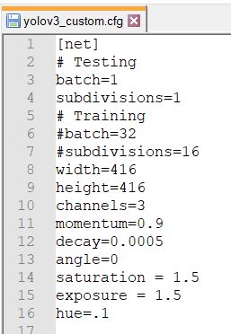
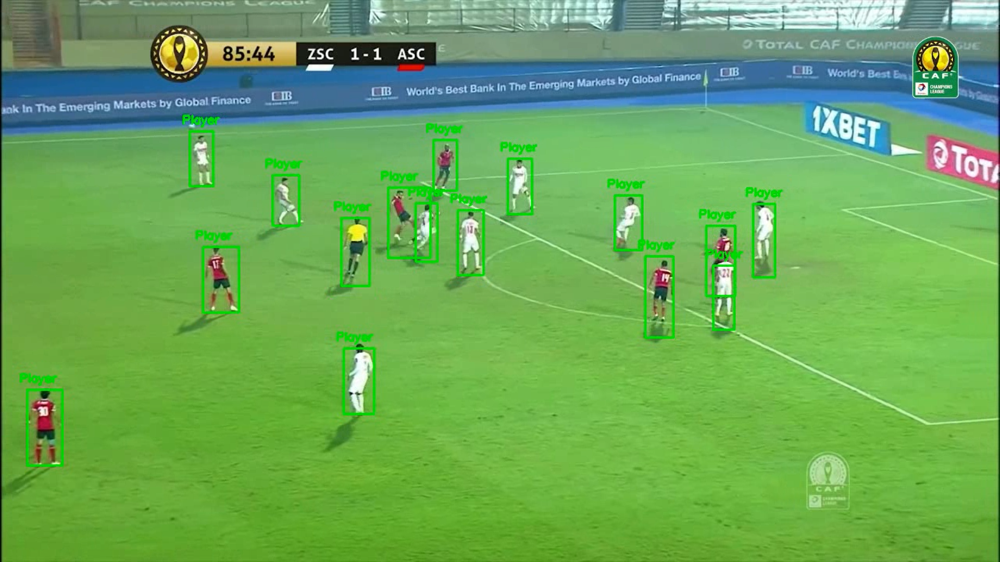
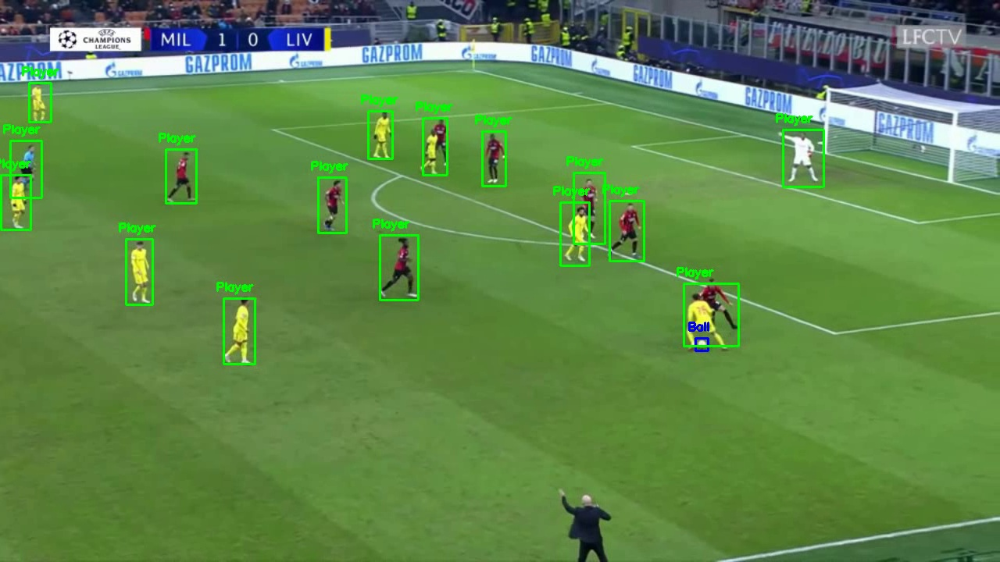

# Ball-Player Detection

## Transfer Learning 
In practice, very few people train an entire Convolutional Network from scratch (with random initialization), because it is relatively rare to have a dataset of sufficient size. Also a pre-trained model can drastically improve the computational effort (time/cost) of training an image classification model. So that’s why the transfer learning approach is used in this project.
`Transfer learning`  is the reuse of a pre-trained model on a new problem. It's currently very popular in deep learning because it can train deep neural networks with comparatively little data.

## Transfer learning with YoloV3
### What is YOLO? 
   - YOLO is an abbreviation for the term ‘You Only Look Once’. This is an algorithm that detects and recognizes various objects in a picture (in real-time). Object detection in YOLO is done as a regression problem and provides the class probabilities of the detected images. YOLO algorithm employs convolutional neural networks (CNN) to detect objects in real-time. As the name suggests, the algorithm requires only a single forward propagation through a neural network to detect objects.
### Loading and Training 
- The neural network model architecture and hyper parameters values are stored in the yolov3.cfg file. The Pre-trained weights are stored in a weights file
- You can find weights and cfg file at https://github.com/pjreddie/darknet
- Modifications done to the cfg file to fit to the problem we're trying to solve :
    - 
    -  Change line `classes=80` to `classes =2`(Ball , Player) in last 3 [Yolo]-layers 
    -  change [filters=255] to `filters= 21` filters this will be done  in the 3 [convolutional] before each [Yolo] layer, the number of filters is calculated from this equation : `(classes + 5)x3`
    -  In training we set `batch size = 16` and `subdivisions = 8`
    -  In inference we set `batch size = 1` and `subdivisions = 1`
    
- The model was trained using google colab free GPU (Tesla-K80) for 5 hours  (1500 iterations)
- A weights file is the final output after training which will be used for object detection in our model
### Dataset 
the model is trained on a custom dataset specifically made for this purpose gathered and labeled manually .The dataset consists of 6 football matches for 12 different teams.Initially, the videos are processed and unnecessary parts like zoom-ins, replays, etc., are removed to obtain only the relevant frames from each game(main camera)
## Output Samples 

## Demo
https://user-images.githubusercontent.com/65700097/157592855-8a4f85e3-0676-449e-a0d1-fc7a78c8a64d.mp4

